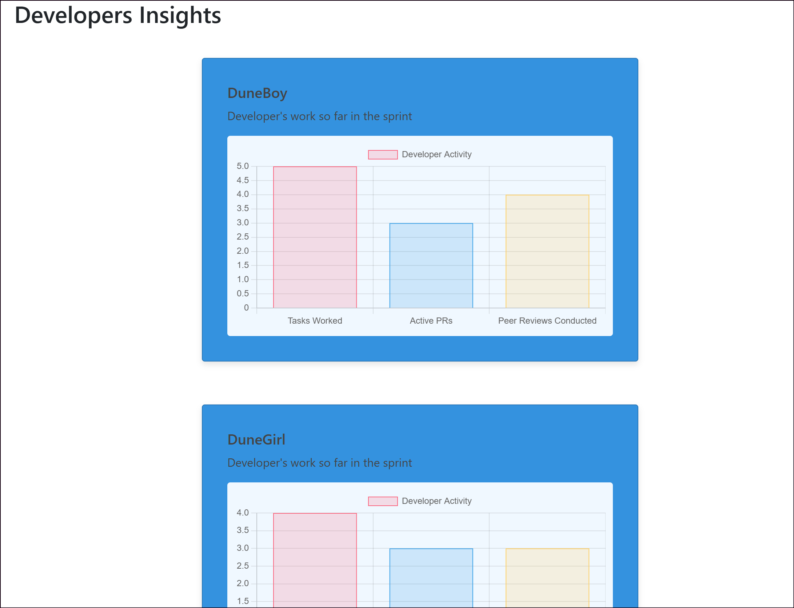

# peekaboo-azure-dashboard
A dashboard for giving a peek into developer insights and team project insights on Azure.

## Purpose
The purpose of this web application is to provide a quick peek into the weekly activity of a team of developers. A simple chart for each developer is generated that shows some of their most relevant stats for their development process.

## Future Features
- [ ] Display individual highlights submitted by developers that may capture more than what the data shows. These are simple one-liners that capture an important thing that developer got done during the week.
- [ ] Display insights for an individual project. Mainly should describe progress in the sprint and projected dates of completion.
- [ ] Ability to print insights out in PDF format.
